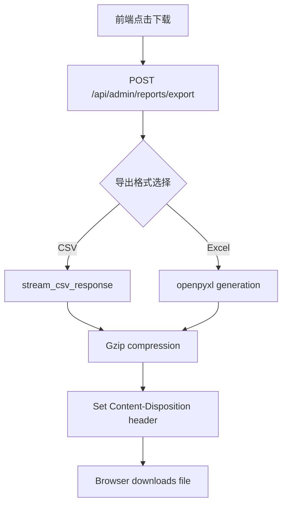

# 📊 **统计数据导出功能设计方案**

**优先级**: P1 - High (业务需求强烈)  
**预计开发时间**: 2-3 个工作日  

---

## 🎯 **一、需求分析**

### **业务场景**

| 角色 | 使用场景 | 核心价值 |
|------|---------|---------|
| **运营人员** | 周报/月报汇总各客户消费数据 | 对账核算 |
| **财务人员** | 月度营收报表导出做账 | 财务审计 |
| **数据分析** | 批量下载用于 Excel 二次分析 | 深度洞察 |
| **客户成功** | 为客户提供用量报告 | 客户服务 |

### **功能范围**

基于当前系统已有的统计数据：
- ✅ 按日/周/月维度聚合
- ✅ 支持多条件筛选（用户/时间/服务类型）
- ❌ **CSV 导出** (待实现)
- ❌ **Excel 导出** (待实现)
- ❌ PDF 报表生成 (可选增强)

---

## 🔧 **二、技术实现方案**

### **方案概述**



---

### **API 端点设计**

#### **1. 导出请求接口**

```python
@router.post("/api/admin/reports/export")
async def export_statistics(
    request: ExportRequest,
    current_user = Depends(get_admin_user),
    conn: BusinessDbDep = Depends(BusinessDbDep)
):
    """Export billing statistics to file."""
    
    # Validate time range (max 90 days for performance)
    if (request.end_date - request.start_date).days > 90:
        raise HTTPException(400, "Max 90 days per export")
    
    # Generate unique export ID for async tracking
    export_id = str(uuid4())
    
    # Queue background task (for large exports)
    if request.record_count > 5000:
        redis.lpush("export_queue", json.dumps({
            "export_id": export_id,
            "type": request.format,
            "filters": request.dict(),
            "user_id": current_user.id
        }))
        
        return {"export_id": export_id, "status": "queued"}
    
    # For small exports, generate synchronously
    return await generate_export_response(conn, request)
```

**请求参数**:
```python
class ExportRequest(BaseModel):
    format: Literal["csv", "xlsx"] = "csv"
    start_date: date
    end_date: date
    service_types: List[str] = ["all"]  # viral_data, video_768p, etc.
    user_ids: Optional[List[str]] = None  # If None → all users
    department_ids: Optional[List[str]] = None
    min_revenue_fen: Optional[int] = None
    max_revenue_fen: Optional[int] = None
```

---

#### **2. CSV Export Implementation**

```python
from io import StringIO
import csv
import gzip

async def stream_csv_response(
    conn: BusinessConnection, 
    request: ExportRequest
) -> Response:
    """Stream CSV directly from DB to avoid memory overflow."""
    
    # Prepare query with filters
    query = """
        SELECT 
            wt.user_id,
            u.email as user_email,
            DATE(wt.created_at) as billing_date,
            bo.service,
            COUNT(*) as transaction_count,
            SUM(wt.available_delta) as credits_used,
            SUM(ABS(wt.available_delta)) * s.unit_cost_fen / 100 as revenue_fen,
            wt.billing_round
        FROM wallet_transactions wt
        JOIN billing_operations bo ON wt.billing_operation_id = bo.id
        JOIN services s ON bo.service = s.name
        LEFT JOIN users u ON wt.user_id = u.id
        WHERE wt.created_at BETWEEN %s AND %s
          AND (%s::text[] IS NULL OR bo.service = ANY(%s::text[]))
          AND (%s::text[] IS NULL OR wt.user_id = ANY(%s::text[]))
        GROUP BY user_id, email, billing_date, service, billing_round
        ORDER BY billing_date DESC, service
    """
    
    params = (
        request.start_date,
        request.end_date,
        request.service_types if request.service_types != ["all"] else None,
        request.service_types if request.service_types != ["all"] else None,
        request.user_ids if request.user_ids else None,
        request.user_ids if request.user_ids else None,
    )
    
    # Execute and stream rows
    result = conn.execute(query, params)
    
    output = StringIO()
    writer = csv.writer(output)
    
    # Header row
    writer.writerow([
        "User ID", "Email", "Date", "Service", 
        "Transactions", "Credits Used", "Revenue (Fen)", "Billing Round"
    ])
    
    # Stream rows
    for row in result:
        writer.writerow(row)
    
    # Compress
    gzipped = gzip.compress(output.getvalue().encode('utf-8'))
    
    return Response(
        content=gzipped,
        media_type="application/gzip",
        headers={
            "Content-Disposition": f'attachment; filename="billing_export_{now}.csv.gz"'
        }
    )
```

---

#### **3. Excel Export Implementation**

```python
from openpyxl import Workbook
from openpyxl.styles import Font, PatternFill, Alignment

async def generate_excel_response(
    conn: BusinessConnection,
    request: ExportRequest
) -> Response:
    """Generate formatted Excel file with multiple sheets."""
    
    wb = Workbook()
    
    # Sheet 1: Summary by Day
    ws_summary = wb.active
    ws_summary.title = "Daily Summary"
    
    summary_query = """
        SELECT 
            DATE(created_at) as day,
            service,
            COUNT(*) as transaction_count,
            SUM(ABS(available_delta)) as total_credits,
            SUM(ABS(available_delta)) * 0.01 as revenue_yuan
        FROM wallet_transactions wt
        JOIN billing_operations bo ON wt.billing_operation_id = bo.id
        WHERE created_at BETWEEN %s AND %s
          AND bo.user_id IS NOT NULL  -- exclude platform-borne
        GROUP BY day, service
        ORDER BY day DESC
    """
    
    ws_summary.append(["Day", "Service", "Transactions", "Credits", "Revenue (Yuan)"])
    
    for row in conn.execute(summary_query, (request.start_date, request.end_date)):
        ws_summary.append(row)
    
    # Format summary sheet
    bold_font = Font(bold=True)
    header_fill = PatternFill(start_color="4472C4", end_color="4472C4", fill_type="solid")
    
    for cell in ws_summary[1]:
        cell.font = bold_font
        cell.fill = header_fill
    
    # Sheet 2: Detailed Transactions
    ws_detail = wb.create_sheet("Transaction Details")
    detail_query = """
        SELECT 
            wt.id,
            wt.user_id,
            u.email,
            wt.created_at,
            bo.service,
            wt.available_delta,
            ABS(wt.available_delta) * s.unit_cost_fen / 100 as cost_fen
        FROM wallet_transactions wt
        JOIN billing_operations bo ON wt.billing_operation_id = bo.id
        JOIN services s ON bo.service = s.name
        LEFT JOIN users u ON wt.user_id = u.id
        WHERE wt.created_at BETWEEN %s AND %s
        ORDER BY wt.created_at DESC
    """
    
    ws_detail.append(["TXN ID", "User ID", "Email", "Timestamp", "Service", "Delta", "Cost (Fen)"])
    
    for row in conn.execute(detail_query, (request.start_date, request.end_date)):
        ws_detail.append(row)
    
    # Auto-width columns
    for column_cells in ws_detail.columns:
        maximum_length = 0
        column_letter = column_cells[0].column_letter
        for cell in column_cells:
            try:
                if len(str(cell.value)) > maximum_length:
                    maximum_length = len(str(cell.value))
            except:
                pass
        adjusted_width = min(maximum_length + 2, 50)
        ws_detail.column_dimensions[column_letter].width = adjusted_width
    
    # Save to BytesIO
    output = BytesIO()
    wb.save(output)
    output.seek(0)
    
    return Response(
        content=output.read(),
        media_type="application/vnd.openxmlformats-officedocument.spreadsheetml.sheet",
        headers={
            "Content-Disposition": f'attachment; filename="billing_export_{now}.xlsx"'
        }
    )
```

---

### **数据库索引优化建议**

```sql
-- Add composite index for export queries
CREATE INDEX IF NOT EXISTS idx_wallet_txns_date_service 
ON wallet_transactions(created_at, billing_operation_id) 
WHERE created_at >= NOW() - INTERVAL '1 year';

-- Partial index for active period only
CREATE INDEX IF NOT EXISTS idx_billing_ops_active_users
ON billing_operations(user_id, created_at)
WHERE user_id IS NOT NULL AND state = 'SUCCEEDED';
```

---

## ✅ **三、验收标准**

| ID | 测试项 | 预期结果 | 测试方法 |
|----|--------|---------|---------|
| TV-01 | CSV 导出生成 | 成功下载.csv.gz 文件 | Manual upload test |
| TV-02 | Excel 导出生成 | 成功下载.xlsx 文件含双 Sheet | Open in Excel verify |
| TV-03 | 大数据量性能 | ≤30s for 10K records | Load testing |
| TV-04 | 内存占用 | <500MB peak RAM | Memory profiling |
| TV-05 | 特殊字符处理 | Unicode 正常显示（中文用户名） | Test with Chinese chars |
| TV-06 | 空结果处理 | 返回 200 OK + empty file (header only) | Query no-matching-date |
| TV-07 | 权限控制 | Non-admin gets 403 Forbidden | AuthZ test |
| TV-08 | 时间范围限制 | >90 days returns 400 error | Boundary test |

---

## 📋 **四、开发任务分解**

```markdown
Day 1: Core Implementation
- [ ] Create export_controller.py
- [ ] Implement CSV streaming logic
- [ ] Implement Excel workbook generation
- [ ] Add database queries with indexes

Day 2: Testing & Optimization
- [ ] Write unit tests (pytest)
- [ ] Performance tuning for large datasets
- [ ] Add async task support for >5000 rows

Day 3: Integration & Docs
- [ ] Update API documentation (OpenAPI/Swagger)
- [ ] Frontend UI integration (add dropdown button)
- [ ] User guide documentation
```

---

## 🚀 **五、前端集成建议**

### **新增 UI 组件**

```typescript
// components/BillingExportButton.tsx
export const BillingExportButton = ({ reportId }) => {
  const [exportFormat, setExportFormat] = useState<"csv" | "xlsx">("csv");
  
  const handleExport = async () => {
    const formData = new FormData();
    formData.append("format", exportFormat);
    formData.append("start_date", startDateValue);
    formData.append("end_date", endDateValue);
    
    const response = await fetch('/api/admin/reports/export', {
      method: 'POST',
      body: formData
    });
    
    if (response.ok) {
      const blob = await response.blob();
      const url = window.URL.createObjectURL(blob);
      const a = document.createElement('a');
      a.href = url;
      a.download = `billing_export_${new Date().toISOString()}.${exportFormat}`;
      a.click();
    }
  };
  
  return (
    <div className="flex gap-2">
      <select value={exportFormat} onChange={e => setExportFormat(e.target.value)}>
        <option value="csv">CSV</option>
        <option value="xlsx">Excel</option>
      </select>
      <button onClick={handleExport} className="btn-primary">
        导出报表
      </button>
    </div>
  );
};
```

---

## 💡 **六、扩展功能规划**

### **Phase 2 Enhancement (可选)**

1. **定时任务导出**: 每天自动发送至指定邮箱
2. **PDF 报告生成**: 带图表可视化的精美报表
3. **自定义字段选择**: 允许用户勾选需要的列
4. **Webhook 推送**: 导出完成后回调外部系统

---

**请确认是否需要立即启动开发？预计需要 2-3 个工作日完成。**
