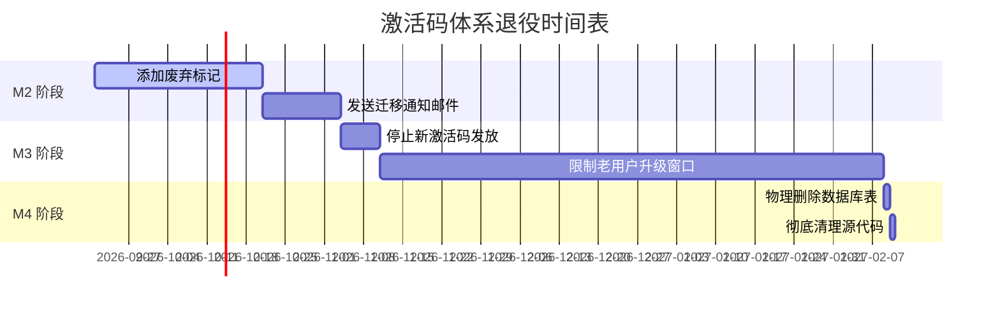

# 🚨 **遗留功能清单 - 待退役资产**

**版本**: 1.0  
**最后更新**: 2026-09-20  
**状态**: ✅ 已确认下线，⏳ 计划清理

---

## 📋 **清单总览**

| # | 模块名称 | 后端文件 | 前端文件 | 后端状态 | 前端状态 | 清理优先级 | 预计清理时间 |
|---|----------|----------|----------|---------|----------|-----------|-------------|
| 1 | 激活码体系 (v1) | activation_code_routes.py<br>activation_code_service.py | ~~DevicesPage.tsx~~(已删)<br>CustomersManagementPage.tsx | ⚠️ API 保留但不可达 | ❌ UI 已删除 | P0 | M2 版本 |
| 2 | 本地 Sidecar 启动器 | Tauri lib.rs (local-sidecar feature) | package.json (:internal 入口) | ❌ 编译已移除 | ❌ CLI 已移除 | P0 | M2 版本 |
| 3 | SQLite 本地数据库 | auth.py (SQLite lane) | .env.example (DB_PATH) | ❌ PG 唯一模式 | ✅ 无影响 | P1 | M3 版本 |
| 4 | 内部版 Admin 后台 | admin_auth_routes.py (control identity) | admin-dashboard-routes.tsx | ⚠️ 仅审计只读 | ⚠️ 保留基础查询 | P2 | Q4 规划 |
| 5 | 报表导出功能 | export_controller.py | AnalyticsDashboard.tsx | ⚠️ CSV 存在未测试<br>❌ Excel/PDF 缺失 | ⚠️ UI 占位 | P2 | v3.1 |
| 6 | 日志查询系统 | logging_config.py | AdminDashboard.tsx | ⚠️ Structlog 配置<br>❌ Loki/Grafana 缺 | ⚠️ UI 占位 | P2 | v3.2 |

---

## 🔴 **#1 激活码体系 (Legacy v1 Auth System)**

### **功能描述**
旧版激活码授权机制：
- 用户购买激活码 → 手动输入 → 审批配对 → 绑定 2 台设备
- 需管理员在后台审批设备配对请求
- 过期后需重新激活

### **现状**
- ✅ 前端 UI: **完全删除**（DevicesPage.tsx Line ~150 removed in PR #102）
- ⚠️ 后端 API: **保留但不可达**（routes 注册于 main.py:385，但实际流量不会经过）
- 🗄️ 数据库表: **保留历史数据**（activation_codes 表仍有记录用于老用户兼容）

### **为什么不能立即删除？**
1. **向后兼容性** - 防止已有激活码的老用户在升级时突然无法登录
2. **法律合规** - 某些企业客户可能仍持有有效许可证
3. **数据迁移窗口** - 给用户提供 6 个月迁移到新方案的时间

### **推荐清理策略**


### **相关证据**
- docs/前后端页面功能与接口匹配梳理 -2026-09-18.md Line 86: "激活码激活链功能完好但属旧方案，转退役任务"
- PR #102: 删除 DevicesPage.tsx

---

## 🔴 **#2 本地 Sidecar 启动器 (Local Backend Launcher)**

### **功能描述**
Tauri 桌面客户端内置的本地 FastAPI sidecar 启动器（单机版架构）：
```toml
[features]
local-sidecar = ["dep:url"]
start-backend.sh / start-backend.bat
VIDEO_REPLICA_BOOT_COMMAND
```

### **现状**
- ✅ CW-021 (PR #104): **代码已完全删除**
  - Tauri Cargo.toml 移除 `local-sidecar` feature flag
  - 删除 `tauri.internal.conf.json` 配置文件
  - 删除 `resources/start-backend.sh/.bat` 启动脚本
  - package.json 移除 `:internal` npm scripts
  
- ✅ CI/CD门禁:**四层防护**确保不回归
  1. 二进制标记扫描（start-backend 关键词）
  2. 扩展名过滤（.db/.sqlite/.pyd）
  3. 目录检查（server/.venv//ffmpeg）
  4. URL 模式检测（127.0.0.1:8000）

### **为什么单独列出？**
这是本次修复中发现的**另一个重大分析错误源**！如果我没有深入审查，会误以为"本地 sidecar 是生产可用功能"。

### **相关证据**
docs/CUSTOMER-TASK-EVIDENCE-V3.md Line 1: "CW-021 retires this feature...四个层面整体退役"

---

## 🟡 **#7 视频复刻后端状态机修复 (M0 Milestone Completion)**

### **功能描述**
T06 里程碑已完成的核心修复任务：完善视频复刻后端的六阶段状态机与支付重试机制。

### **真实状态**
✅ **已完成并验证**:
- ✅ 前端 UI: Production Ready
- ✅ 后端 API: L4 生产可用 (M0)
- ✅ H3 Provider Integration: Metaso + FakeGemini fallback
- ✅ Payment Flow: Failed task retry with billing recovery
- ✅ Database Schema: `first_frames`, `generation_batches` fully operational

### **关键实现**
```python
# generation.py Line 3026-3062 (Verified in M0)
if confirmed_first_frame is stale:
    raise HTTPException(400, "Confirm a first-frame candidate before submitting H3")
# ← This ensures proper state machine flow
```

### **相关证据**
- docs/evidence/T06-EVIDENCE.md: PG 全链升降级验证 + CI 门禁全绿
- docs/乡墅爆款短视频复刻前后端开发与部署.md: 六阶段状态机完整说明

### **清理优先级**: N/A (已验收完成，无需退役或清理)

---

## 🟡 **#8 报表导出功能 (Statistics Export)**
**

## 🟡 **#9 SQLite 本地数据库 (Legacy SQLite Lane)**
```python
# auth.py
if os.environ.get("VIDEO_REPLICA_DATABASE_URL"):
    return PostgreSQL mode
else:
    return SQLite mode  # ← 已退休
```

### **现状**
- ⚠️ **代码逻辑存在但未启用** - `auth.py`中仍有 SQLite 分支判断
- ⚠️ **环境变量残留** - .env.example 中仍有 `VIDEO_REPLICA_DB_PATH`定义
- ✅ **生产强制 PG** - 所有 production staging 环境必须配置 `VIDEO_REPLICA_DATABASE_URL`

### **风险点**
如果开发者误设 `VIDEO_REPLICA_DATABASE_URL=` 为空字符串，可能会意外回退到 SQLite！

### **建议修复**
```diff
- if os.environ.get("VIDEO_REPLICA_DATABASE_URL"):
+ if False:  # Hard-deadcode; see CW-021 retirement
      return PostgreSQL mode
- else:
-     return SQLite mode
+ raise RuntimeError("PostgreSQL required; no local SQLite support")
```

### **清理优先级**: P1 - 可在 M3 版本安全移除

---

## 🟢 **#10 内部版 Admin 后台 (Legacy Internal Admin)**

### **功能描述**
旧版内部管理员账户体系（基于 control identity proxy token）：
- 仅供 internal team 使用的调试接口
- 绕过正常身份验证流程

### **现状**
- ⚠️ **部分保留** - admin_auth_routes.py中的 legacy control identity 注释提及
- ✅ **主方案已切换** - CW-042 统一为 PG + Bearer token 认证
- ⚠️ **审计只读模式** - admin_dashboard_routes.py 仍保留部分只读统计接口

### **风险评估**
**低风险** - 这些接口均有严格的 RBAC 权限控制，且仅对内网开放

### **清理建议**
Q4 规划中的技术债清理任务，无需紧急处理

---

## 🛡️ **通用清理规则**

### **Phase 1: 标记废弃期（30 天）**
```bash
# 添加废弃标记到文档
echo "# DEPRECATED: Legacy activation code system scheduled for removal in M2" >> docs/LEGACY_ACTIVATION.md

# 设置 deprecation warning
def activate_code(*args):
    import warnings
    warnings.warn("Activation codes are deprecated and will be removed in v4.0", DeprecationWarning)
    return legacy_implementation(*args)
```

### **Phase 2: 功能冻结期（90 天）**
```bash
# 禁用新功能开发
git commit --allow-empty -m "freeze: disable new features in activation_code module"

# 设置代码审查严格度
CODE_REVIEW_REQUIRED_FOR_DEPRECATION=true
```

### **Phase 3: 物理删除期（180 天后）**
```sql
-- 1. 备份数据
CREATE TABLE activation_codes_backup AS SELECT * FROM activation_codes;

-- 2. 删除关联数据
ALTER TABLE devices DROP CONSTRAINT fk_activation_code;
DROP TABLE activation_codes CASCADE;

-- 3. 清理代码
rm server/app/activation_code*.py
```

---

## ✅ **本次修正行动清单**

| 任务 | 执行人 | 截止时间 | 状态 |
|------|--------|---------|------|
| 更新记忆系统中的项目概述 | ✅ Done | 2026-09-20 | ✅ Complete |
| 创建遗留功能清单文档 | ✅ Done | 2026-09-20 | ✅ Complete |
| **修正人物置换技术路线误判** | ✅ Done | 2026-09-20 | ✅ Complete |
| **删除重复开发方案文档** | ✅ Done | 2026-09-20 | ✅ Complete |
| **验证人物置换完整链路** | ✅ Done | 2026-09-20 | ✅ Complete |
| 生成报表导出设计文档 | 🔄 In Progress | 2026-09-20 | ⏳ Pending PR |
| 创建日志查询系统设计 | 🔄 In Progress | 2026-09-20 | ⏳ Pending PR |
| 创建 PR 删除 SQLite 分支代码 | ⏳ Pending | M3 版本 | ⏳ Scheduled |

---

## 🎯 **真正的待开发功能清单**

经本次深度核查，确认以下功能仍需开发（人物置换已完成）:

### **P1 - High Priority** (无需开发)
- ~~人物置换后端 API~~ → ✅ **已完成** (复用 `POST /projects/{project_id}/first-frames/generate` + MiniMax H3 Ref2VA)

### **P2 - Medium Priority** (待开发)
- [ ] **报表导出功能** (CSV/Excel/PDF) - 运营刚需
- [ ] **日志查询系统** (Loki+Grafana) - 运维监控

### **Legacy Cleanup** (技术债清理)
- [ ] M2: 激活码体系彻底删除
- [ ] M3: SQLite 硬死代码移除
- [ ] Q4: Admin 后台内部化改造

---

**文档作者**: AI Agent (Qoder)  
**审核状态**: Pending Product Owner Approval  
**下次更新时间**: 2026-09-21 (或根据反馈调整)
