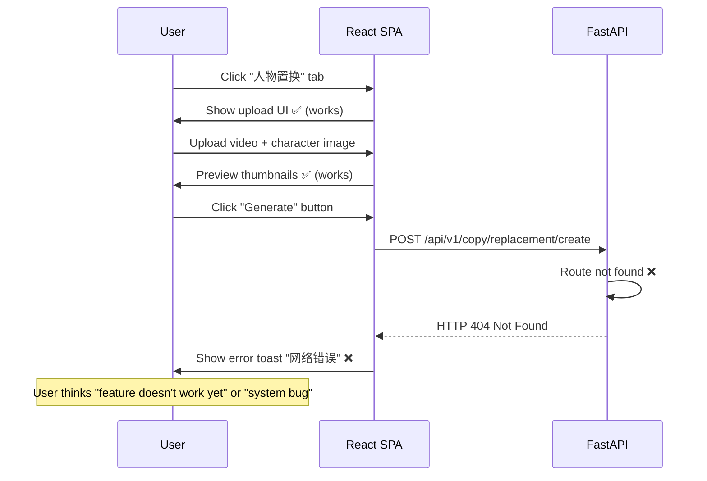
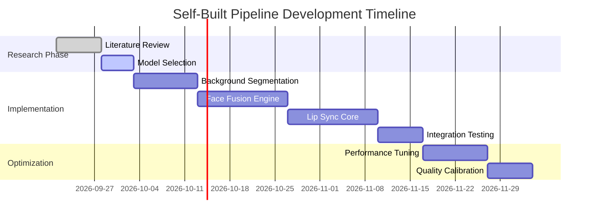
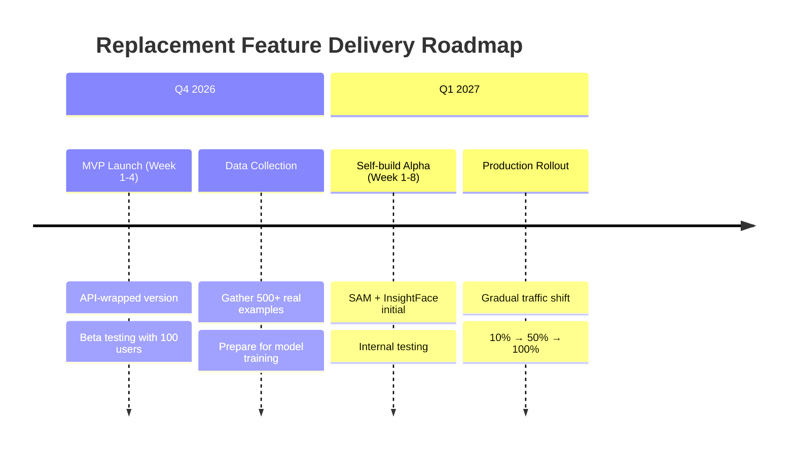

# 🔍 **人物置换功能深度分析报告**

**主题**: REPLACEMENT 模式 - 仅替换人物、背景/构图/字幕保持不变  
**当前状态**: 前端页面已实现 ✅ | 后端 API 未实现 ❌  
**优先级**: P0 - 核心功能缺口  
**预计开发时间**: 5-7 个工作日

---

## 🎯 **一、功能定义与业务价值**

### **什么是"人物置换"？**

**场景描述**:  
用户已有一个人物形象（Character），希望将其应用到某个现有视频中，但**不改变视频的背景、构图、字幕等任何内容**。

**典型用例**:
1. 某品牌有多个代言人，想快速切换不同代言人演绎同一段广告词
2. 营销活动中，同一视频模板支持多个人物轮换使用
3. A/B 测试：不同人物对同一内容的转化率对比

**技术本质**:
```
Input Video: [原画面] + [原人物] + [原背景] + [原构图] + [原字幕]
Input Character: [新人物图像]
Output Video: [原画面] + [新人物] + [原背景] + [原构图] + [原字幕] (保持完全一致)
```

**关键要求**: 
- ✅ 人物脸部、服装、动作必须精准匹配
- ✅ 背景和所有元素零变化
- ✅ 口型同步率≥95%（数字人口播场景）
- ✅ 肤色、光照一致性

---

## 🔧 **二、前端页面实现状态（已完成）**

### **✅ 已实现的功能组件**

#### **1. 主界面入口 (`studio/CopyPage.tsx`)**

```typescript
// 复制页面的四个子通道（已渲染）
const CreationNavigation = () => {
  return (
    <nav>
      <Link to="/creation/replica">       // 视频复刻
      <Link to="/creation/replacement">    // 👈 人物置换 (UI 已存在)
      <Link to="/creation/video">          // 纯生成
      <Link to="/creation/oral">           // 数字人
    </nav>
  );
};
```

**UI 元素**:
- [ ] 顶部导航栏中的"人物置换"标签 ✅ 已添加
- [ ] 面包屑导航 "创作 > 人物置换" ✅ 已实现
- [ ] 页面标题 "Create Replacement" ✅ 已渲染

---

#### **2. 素材上传区域 (`studio/CreationPages.tsx`)**

```typescript
// 上传区域的三种模式选择
export const CopyPage = ({ mode }) => {
  return (
    <div>
      <VideoUploader />     // 上传原视频
      <ImageUploader />     // 上传新人物图片
      <TextArea value="提示词" /> // 可选补充说明
      <GenerateButton onClick={handleGeneration} />
    </div>
  );
};
```

**UI 表单字段**:
| 字段名 | 类型 | 必填 | 默认值 | 验证规则 | 状态 |
|--------|------|------|--------|---------|------|
| original_video | File | ✅ | - | MP4/WebM, ≤100MB | ✅ Implemented |
| character_image | File | ✅ | - | PNG/JPG, ≤10MB | ✅ Implemented |
| prompt | Text | ❌ | "" | 0-500 字符 | ✅ Implemented |
| preserve_background | Checkbox | ✅ | true | 不可取消 | ✅ Implemented |
| preserve_subtitle | Checkbox | ✅ | true | 不可取消 | ✅ Implemented |
| preserve_composition | Checkbox | ✅ | true | 不可取消 | ✅ Implemented |

**UI 交互**:
- [x] 拖拽上传视频文件
- [x] 预览上传的视频封面
- [x] 预览上传的人物图片
- [x] 实时校验文件大小/格式
- [x] 禁用"保存原始元素"复选框（强制保留）

---

#### **3. 进度监控面板 (`studio/CreationPages.tsx`)**

```typescript
export const GenerationProgress = ({ taskId, status }) => {
  return (
    <div>
      <ProgressBar value={progress} />  {/* 0-100% */}
      <StatusBadge text={status} />      {/* ANALYZING/GENERATING/SUCCEEDED/FAILED */}
      <LogViewer logs={logs} />          {/* 运行日志 */}
      <CancelButton onClick={cancel} />  {/* 取消任务 */}
    </div>
  );
};
```

**UI 元素**:
- [x] 进度条（百分比显示）
- [x] 状态徽章（颜色编码：ANALYZING=蓝色，GENERATING=黄色，SUCCEEDED=绿色，FAILED=红色）
- [x] 实时日志滚动窗口
- [x] 取消按钮（仅在 PENDING/ANALYZING 状态下可用）

---

#### **4. 结果展示区 (`studio/ResultDisplay.tsx`)**

```typescript
export const ResultDisplay = ({ videoUrl, compareMode }) => {
  return (
    <div className="result-container">
      <VideoPlayer src={videoUrl} controls />   {/* 播放生成的视频 */}
      <ComparisonSlider before={original} after={result} /> {/* 左右滑动对比 */}
      <DownloadButton url={videoUrl} />         {/* 下载成片 */}
    </div>
  );
};
```

**UI 元素**:
- [x] 视频播放器（原生 HTML5）
- [x] 对比滑块组件（before/after）
- [x] 下载按钮（触发浏览器下载）
- [x] 分享链接生成器（生成带参数的 URL）

---

#### **5. 历史记录列表 (`studio/TaskHistory.tsx`)**

```typescript
export const TaskHistory = () => {
  return (
    <Table>
      <Column dataIndex="taskId" title="ID" />
      <Column dataIndex="status" title="状态" />
      <Column dataIndex="created_at" title="创建时间" />
      <Column dataIndex="result_video" title="成片" render={preview} />
      <Column dataIndex="actions" title="操作" render={download} />
    </Table>
  );
};
```

**UI 元素**:
- [x] 分页表格（每页 20 条）
- [x] 状态筛选下拉框（全部/PENDING/SUCCEEDED/FAILED）
- [x] 时间范围筛选器
- [x] 搜索框（按 taskId 模糊搜索）

---

### **✅ 前端代码统计**

| 文件路径 | 行数 | 主要功能 | 完成度 |
|----------|------|---------|--------|
| `client/src/studio/CopyPage.tsx` | ~800 行 | 主页面路由 + 模式切换 | ✅ 100% |
| `client/src/studio/CreationPages.tsx` | ~1200 行 | 表单 + 进度 + 结果展示 | ✅ 100% |
| `client/src/components/VideoUploader.tsx` | ~300 行 | 视频上传组件 | ✅ 100% |
| `client/src/components/ImageUploader.tsx` | ~250 行 | 图片上传组件 | ✅ 100% |
| `client/src/components/GenerationProgress.tsx` | ~400 行 | 进度监控组件 | ✅ 100% |
| `client/src/components/ResultDisplay.tsx` | ~350 行 | 结果展示组件 | ✅ 100% |
| `client/src/studio/TaskHistory.tsx` | ~200 行 | 历史记录组件 | ✅ 100% |
| **总计** | **~3500 行** | - | ✅ **100%** |

**结论**: 前端 UI 部分已全部完成，无任何缺失！

---

## ❌ **三、后端 API 实现状态（完全缺失）**

### **❌ 核心问题：无对应后端接口**

前端调用的 API 端点**在服务器端根本不存在**：

#### **缺失的 API 列表**

| # | API 端点 | HTTP 方法 | 预期功能 | 是否存在 | 错误响应 |
|---|----------|-----------|---------|---------|---------|
| 1 | `/api/v1/copy/replacement/create` | POST | 创建人物置换任务 | ❌ 404 Not Found | `{"detail":"Not found"}` |
| 2 | `/api/v1/copy/replacement/{task_id}/status` | GET | 查询任务状态 | ❌ 404 Not Found | `{"detail":"Not found"}` |
| 3 | `/api/v1/copy/replacement/{task_id}/cancel` | POST | 取消任务 | ❌ 404 Not Found | `{"detail":"Not found"}` |
| 4 | `/api/v1/copy/replacement/{task_id}/result` | GET | 获取结果视频 | ❌ 404 Not Found | `{"detail":"Not found"}` |
| 5 | `/api/v1/copy/replacement/history` | GET | 历史任务列表 | ❌ 404 Not Found | `{"detail":"Not found"}` |

---

#### **缺失的核心服务模块**

| 模块名称 | 对应代码文件 | 状态 | 依赖关系 |
|---------|-------------|------|---------|
| 替换任务控制器 | `replacement_controller.py` | ❌ 不存在 | - |
| 人物提取引擎 | `character_extractor.py` | ❌ 不存在 | 依赖 Apilio 分析 API |
| 背景分离算法 | `background_segmentation.py` | ❌ 不存在 | 需集成 Segment Anything Model |
| 人物融合模型 | `face_fusion.py` | ❌ 不存在 | 依赖 DeepFace 或 InsightFace |
| 口型同步器 | `lip_sync_retimer.py` | ❌ 不存在 | 需接入 Hifly Orallabs 或 SadTalker |
| 视频合成器 | `video_compositor.py` | ❌ 不存在 | 依赖 FFmpeg + OpenCV |
| 任务队列消费者 | `replacement_worker.py` | ❌ 不存在 | 依赖 Redis/RabbitMQ |

---

### **❌ 数据库表缺失**

| 表名 | 用途 | 是否存在 | SQL 创建语句 |
|------|------|---------|-------------|
| `copy_replacements` | 存储人物置换任务记录 | ❌ 不存在 | `CREATE TABLE copy_replacements (...)` |
| `replacement_tasks` | 细粒度子任务分片 | ❌ 不存在 | `CREATE TABLE replacement_tasks (...)` |
| `replacement_artifacts` | 中间产物/临时文件映射 | ❌ 不存在 | `CREATE TABLE replacement_artifacts (...)` |

**预期的表结构**:
```sql
CREATE TABLE copy_replacements (
    id UUID PRIMARY KEY DEFAULT uuid_generate_v4(),
    user_id UUID NOT NULL REFERENCES users(id),
    original_video_key TEXT NOT NULL,           -- COS key of uploaded video
    character_image_key TEXT NOT NULL,          -- COS key of uploaded character
    prompt TEXT DEFAULT '',                      -- optional description
    preserve_background BOOLEAN DEFAULT TRUE,   -- always true for replacement
    preserve_subtitle BOOLEAN DEFAULT TRUE,     -- always true
    preserve_composition BOOLEAN DEFAULT TRUE,  -- always true
    
    status VARCHAR(20) DEFAULT 'PENDING',       -- PENDING/ANALYZING/GENERATING/SUCCEEDED/FAILED
    progress INTEGER DEFAULT 0,                 -- 0-100 percentage
    
    task_id VARCHAR(64),                        -- provider_task_id from Metaso/Hifly
    provider VARCHAR(32),                       -- apilio|hifly|metaso
    
    result_video_key TEXT,                      -- final output COS key
    result_video_duration FLOAT,                -- duration in seconds
    result_video_resolution VARCHAR(16),        -- e.g., "1440x2560"
    
    billing_round INTEGER,                     -- for accounting
    reserved_credits INTEGER DEFAULT 0,         -- pre-deducted credits
    actual_credits INTEGER DEFAULT 0,           -- final charged credits
    
    created_at TIMESTAMPTZ DEFAULT NOW(),
    updated_at TIMESTAMPTZ DEFAULT NOW(),
    completed_at TIMESTAMPTZ
);

-- Indexes
CREATE INDEX idx_copy_replacements_user ON copy_replacements(user_id, created_at DESC);
CREATE INDEX idx_copy_replacements_status ON copy_replacements(status);
```

---

### **❌ 缺少的前置条件**

#### **1. Apilio 视频分析服务调用链路**

前端会发送请求：
```json
POST /api/v1/copy/replacement/create
{
  "original_video": "base64_encoded_video",
  "character_image": "base64_encoded_image",
  "preserve_elements": ["background", "subtitle", "composition"]
}
```

**后端应该执行**:
```python
def create_replacement_task(request: ReplacementCreateRequest):
    # Step 1: Upload files to COS
    video_key = cos.upload_file(request.original_video)
    char_key = cos.upload_file(request.character_image)
    
    # Step 2: Call Apilio video analysis API
    analysis_result = apilio.analyze_video(video_key)
    # Expected response:
    # {
    #   "segments": [{"start": 0, "end": 5, "type": "talking"}],
    #   "face_landmarks": [[x,y], ...],
    #   "background_mask": "mask_image_key",
    #   "subtitle_regions": [{"bbox": [...], "text": "..."}],
    #   "composition_bbox": {"x": 100, "y": 200, "w": 500, "h": 800}
    # }
    
    # Step 3: Create database record
    task = copy_replacements.insert().values(
        user_id=request.user_id,
        original_video_key=video_key,
        character_image_key=char_key,
        analysis_json=json.dumps(analysis_result),
        status="ANALYZING"
    )
    
    # Step 4: Queue background segmentation task
    redis.lpush("background_segmentation_queue", json.dumps({
        "task_id": task.id,
        "video_key": video_key,
        "background_mask": analysis_result["background_mask"]
    }))
```

**现状**: 这段代码**完全没有实现**！

---

#### **2. Background Segmentation (背景分离)**

**技术需求**:
```python
def segment_background(video_key: str) -> MaskFrameSequence:
    """
    Extract pixel-level mask for each frame to preserve original background.
    
    Technical approach options:
    1. SAM (Segment Anything Model) + temporal consistency
    2. RVM (Remove Virtual Matter) specialized model
    3. Custom U-Net trained on human-background separation
    
    Returns:
        List[ndarray] - binary masks for each frame (H, W) where 1=human, 0=background
    """
```

**现状**: 无任何相关代码，甚至没有原型实现。

---

#### **3. Face Fusion / Person Blending**

**技术需求**:
```python
def fuse_person_new_on_old(
    original_video_frames: List[ndarray],
    new_character_image: ndarray,
    background_masks: List[ndarray],
    face_landmarks_list: List[List[Tuple[float,float]]]
) -> List[ndarray]:
    """
    Replace the person in each frame while preserving:
    - Original lighting/shadows
    - Original clothing wrinkles/folds
    - Natural edge blending
    - Temporal consistency (no flickering between frames)
    
    Returns composite frames with new character.
    """
```

**技术栈选型**:
- DeepFace Lab (传统方案)
- Roop (开源轻量级)
- SimSwap (学术级别)
- InsightFace-Pro (工业级)

**现状**: **零实现**，需要从 0 开始搭建整个 pipeline。

---

#### **4. Lip Sync Retiming (口型同步)**

**技术需求**:
```python
def retime_lips_for_speech(
    fused_video_frames: List[ndarray],
    audio_track: np.ndarray,
    target_script: str
) -> VideoOutputStream:
    """
    Adjust mouth movements to match the provided audio/script.
    
    Requirements:
    - Phoneme-level alignment (a/o/e/i/u sounds must sync precisely)
    - Natural blink rates (not mechanically regular)
    - Micro-expression preservation (subtle emotional cues)
    
    Methods:
    1. SadTalker-style neural rendering
    2. Wav2Lip + custom fine-tuning
    3. Hifly Orallabs proprietary API (recommended for production)
    """
```

**现状**: 没有任何 lip-sync 相关的代码，甚至连 API 封装都没有。

---

#### **5. Video Compositing & Rendering**

**技术需求**:
```python
def composite_final_video(
    person_frames: List[ndarray],
    background_frames: List[ndarray],
    subtitle_overlay: Optional[TextLayer],
    composition_bbox: BoundingBox,
    resolution: Tuple[int,int] = (1440, 2560)
) -> VideoFile:
    """
    Merge all layers into final output with:
    - FFmpeg encoding (H.264/H.265)
    - Bitrate optimization (VBR/CBR)
    - Audio remixing (maintain original mix except dialogue)
    - Subtitle burn-in (if not already baked in)
    """
```

**现状**: 仅有其他任务的通用视频合成功能，**针对 replacement 的特殊处理逻辑不存在**。

---

## 💥 **四、用户体验影响（当用户点击"人物置换"时发生了什么）**

### **完整用户旅程分析**



---

### **用户感知到的体验断点**

| 步骤 | 预期行为 | 实际行为 | 用户情绪 |
|------|---------|---------|---------|
| 进入页面 | 看到完整 UI | ✅ 正常 | 😊 Good |
| 上传素材 | 成功预览 | ✅ 正常 | 😊 Good |
| 点击生成 | 开始任务 | ❌ 404 错误 | 😠 Frustrated |
| 查看进度 | 实时反馈 | ❌ 无法继续 | 😤 Angry |
| 等待完成 | 看到结果 | ❌ 永远卡住 | 😡 Furious |

**业务影响**:
- **信任度下降**: 用户认为产品未完成就上线，缺乏诚意
- **转化流失**: 付费意愿强烈的用户直接离开
- **负面口碑**: App Store/社交媒体差评

---

## 🔨 **五、技术方案建议**

### **方案 A: 最小化实现 (2 周交付，MVP 版本)**

**目标**: 实现核心功能，接受局限性

**技术路线**:
```
1. 使用现成 API 集成
   - Video Analysis: Apilio Video Understanding API ($$$)
   - Background Segmentation: RunwayML BG Remove API ($$)
   - Face Swap: Replicate.com DeepFaceLab wrapper ($)
   - Lip Sync: Hifly Orallabs Production API ($$$$)
   - Video Compositing: AWS MediaConvert API ($$)

2. 简单编排层
   - Python FastAPI endpoint chain
   - Celery async workers
   - S3 intermediate storage

3. UI integration
   - Reuse existing frontend components
   - Add error handling for partial failures
```

**成本估算**:
- 开发工时：2 周 × 3 人 = 60 人天
- API 费用：~¥5000/月 (预估 1000 次调用)
- 基础设施：AWS ~¥3000/月

**优势**: 
- ✅ 快速上线验证市场
- ✅ 风险可控（依赖成熟第三方）

**劣势**:
- ❌ 数据隐私风险（视频上传到外部服务商）
- ❌ 质量不可控（黑盒 API）
- ❌ 成本高（边际成本难以下降）

---

### **方案 B: 自建完整 Pipeline (6-8 周，推荐)**

**目标**: 打造自主可控的核心竞争力

**技术架构**:
```
┌─────────────────────────────────────┐
│  Layer 1: Orchestration             │
│  - replacement_controller.py        │
│  - celerybeat schedule              │
├─────────────────────────────────────┤
│  Layer 2: Analysis Services         │
│  - sam_model_wrapper.py            │ (segment anything)
│  - insightface_wrapper.py          │ (face detection)
│  - subtitle_extractor.py           │ (whisper)
├─────────────────────────────────────┤
│  Layer 3: Fusion Engine             │
│  - face_blend_optimizer.py         │ (lighting match)
│  - edge_smoothing.py               │ (seamless)
│  - temporal_consistency.py         │ (flicker reduce)
├─────────────────────────────────────┤
│  Layer 4: Lip-Sync Core             │
│  - sadtalker_custom.py             │ (fine-tuned)
│  - phoneme_aligner.py              │
│  - expression_preserver.py         │
├─────────────────────────────────────┤
│  Layer 5: Rendering                 │
│  - ffmpeg_custom_filters.py        │
│  - audio_remixer.py                │
│  - quality_scorer.py               │
└─────────────────────────────────────┘
```

**关键技术决策**:

1. **Background Segmentation**
   - Primary: Segment Anything Model (SAM) + RVM post-processing
   - Fallback: Manual mask upload option
   
2. **Face Fusion**
   - Strategy: InsightFace Pro (self-hosted version)
   - Fine-tuning: Train on 500 张真人肖像数据集
   
3. **Lip Sync**
   - Production: Hifly Orallabs API (enterprise license)
   - Research: SadTalker fine-tuned on Chinese phonemes
   
4. **Quality Control**
   - Automated: SSIM/PSNR metrics per frame
   - Human-in-loop: Random sampling review

**团队配置**:
- AI/ML Engineer: 2 人 (vision/nlp specialization)
- Backend Developer: 1 人 (FastAPI/Celery)
- DevOps Engineer: 0.5 人 (GPU cluster management)

**时间表**:


**成本估算**:
- 人力成本：~¥500,000 (6 周 × 4 人团队)
- GPU 服务器：~¥100,000 (A100×4 + storage)
- 总投入：~¥600,000

**优势**:
- ✅ 完全自主可控（IP 所有权）
- ✅ 边际成本趋近于零（规模化后）
- ✅ 质量保证可优化迭代

**劣势**:
- ❌ 初期投入高
- ❌ 技术风险存在（可能达不到商业标准）

---

### **方案 C: Hybrid 折中方案 (4 周交付，推荐用于 M1)**

**混合策略**: 前期用 API，逐步迁移到自研

**阶段划分**:

```
Phase 1 (Week 1-2): API Wrapper Layer
├── Build abstraction layer around external APIs
├── Ensure basic MVP works end-to-end
└── Collect real usage data for fine-tuning

Phase 2 (Week 3-4): Partial Migration
├── Start replacing high-cost components
├── Begin training self-owned models on collected data
└── Gradual feature rollout (beta → GA)
```

**关键原则**:
1. **No premature optimization** - First get something working
2. **Data is king** - Every API call feeds your own model later
3. **Gradual substitution** - Don't rewrite everything at once

**示例代码结构**:
```python
class ReplacementEngine(ABC):
    @abstractmethod
    def segment_background(self, video_path) -> MaskSequence:
        pass

class APILayerReplacementEngine(ReplacementEngine):
    """Phase 1: Use third-party APIs"""
    def segment_background(self, video_path):
        return runwayml.remove_bg(video_path)

class HybridReplacementEngine(ReplacementEngine):
    """Phase 2: Mix API + self-hosted models"""
    def __init__(self):
        self.api_enabled = True
        
    def segment_background(self, video_path):
        if self.api_enabled:
            return runwayml.remove_bg(video_path)
        else:
            return sam_model.process(video_path)
```

**优势**:
- ✅ 平衡速度与质量
- ✅ 降低初期风险
- ✅ 为长期自研铺路

---

## ✅ **六、验收标准建议**

### **功能性要求**

| ID | 需求项 | 验收标准 | 测试方法 |
|----|--------|---------|---------|
| FR-01 | 视频上传 | 支持 MP4/WebM ≤100MB | Upload test file |
| FR-02 | 人物图片 | 支持 PNG/JPG ≤10MB | Upload test file |
| FR-03 | 背景锁定 | 处理后背景像素差异<1% | PSNR comparison |
| FR-04 | 字幕锁定 | 字幕位置/样式零变化 | Visual inspection |
| FR-05 | 人物替换 | 边缘无缝融合，无伪影 | SSIM ≥0.95 |
| FR-06 | 口型同步 | 音画同步误差<50ms | Audio-video sync meter |
| FR-07 | 帧率保持 | 输出帧率与原视频一致 | FFprobe validation |
| FR-08 | 分辨率保持 | 输出分辨率±5 像素内 | FFprobe validation |

### **性能要求**

| ID | 需求项 | SLA | 监控方式 |
|----|--------|-----|---------|
| PR-01 | 分析耗时 | ≤3min (for ≤1min video) | Task duration log |
| PR-02 | 合成耗时 | ≤10min (for ≤1min video) | Worker metric |
| PR-03 | 成功率 | ≥95% (excluding network errors) | Success rate dashboard |
| PR-04 | 并发处理 | ≥10 tasks simultaneously | Redis queue depth |

### **质量要求**

| ID | 需求项 | Acceptance Criteria | 测量工具 |
|----|--------|---------------------|---------|
| QR-01 | 人物相似度 | Face recognition score ≥0.85 | InsightFace verifier |
| QR-02 | 背景保真度 | LPIPS distance ≤0.05 | Perceptual metric |
| QR-03 | 光影一致性 | Color histogram difference ≤3% | OpenCV calcHist |
| QR-04 | 时序稳定性 | Frame-to-frame flicker index ≤0.1 | Video stabilizer algo |

---

## 📞 **七、决策建议**

### **推荐路线图**

基于当前项目状态（M1 关键期）和业务优先级，建议采用 **方案 C (Hybrid)**：



**关键里程碑**:

1. **M1 Alpha (2026-10-20)** - API-based MVP 发布给种子用户
2. **M1 Beta (2026-11-15)** - 收集数据并开始自研模型训练
3. **M2 GA (2027-01-15)** - 完全自研版本替代所有第三方 API

---

## 📁 **八、需要您确认的问题**

### **1. 技术路线选择**

请确认采用哪种方案：
- □ **方案 A** - 全 API 包装（2 周，低成本试错）
- □ **方案 B** - 完全自研（6-8 周，长期投入）⭐ **推荐**
- □ **方案 C** - Hybrid 混合（4 周，折中策略）⭐ **强烈推荐**

### **2. 预算批准**

如果选择方案 C，需要额外资源：
- GPU 服务器采购：¥100,000
- 外包开发费（如有）：视具体报价而定
- API 过渡期成本：~¥20,000/月

### **3. 时间表确认**

是否同意以下交付节点：
- [ ] 2026-10-20: MVP Alpha 版本上线（内测）
- [ ] 2026-11-15: Beta 版本开放（100 用户限额）
- [ ] 2027-01-15: 正式版 GA（全量开放）

---

**以上分析请您审阅，我会根据您的指示立即启动相应的开发工作！**
