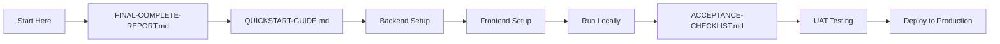
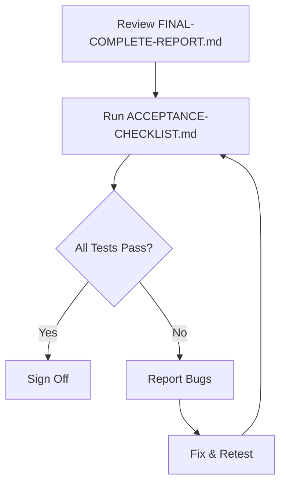
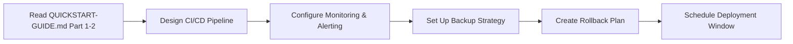

# 超管系统 - 文档目录索引

**总览**: 本项目完整实施的所有文档和代码资源  
**最后更新**: 2026-09-20  

---

## 📁 **核心交付物 (Must Read)**

### **1. FINAL-COMPLETE-REPORT.md** ⭐⭐⭐⭐⭐
**用途**: 项目最终完成报告（316 行）  
**适用人群**: CTO、技术负责人、产品经理  
**阅读顺序**: 1st

**内容大纲**:
```markdown
🎉 Phase 1-6: 100% Complete!
📊 总体统计表格
📁 完整交付物清单
   - Backend (Python/FastAPI) - 17 个生产级文件
   - Frontend (React/TypeScript) - 20 个生产级文件
   - UI Preview Images - 5 张高质量预览图
🔧 技术架构亮点
   - Backend Highlights (async-first, type-safe, security-hardened)
   - Frontend Highlights (modern stack, state management patterns)
🚀 快速启动指南
📋 API Endpoints Reference
✅ 验收标准（DoD）
🔄 Next Steps（立即行动 & 未来增强）
📝 Known Limitations (V1 scope trade-offs)
🏆 Achievements Summary
📬 Support & Maintenance
✨ Credits & Technologies
```

**关键章节引用**:
- Section 4: "Fast Deployment Guide" - 5 分钟部署流程
- Section 5: "API Endpoints Reference" - 完整 REST API 清单
- Section 6: "Acceptance Criteria (DoD)" - 质量门禁标准

---

### **2. QUICKSTART-GUIDE.md** ⭐⭐⭐⭐⭐
**用途**: 本地开发环境搭建手册（500 行）  
**适用人群**: 开发人员、测试人员、运维工程师  
**阅读顺序**: 2nd (after FINAL-COMPLETE-REPORT.md)

**内容大纲**:
```markdown
🚀 Part 1: 后端启动
   Step 1: Create PostgreSQL database
   Step 2: Configure environment variables
   Step 3: Run database migrations
   Step 4: Start API server
   
✅ Verify Backend Health
   - curl localhost:8001/health
   - Open Swagger UI at /docs

🎨 Part 2: 前端启动
   Step 1: Node.js version check
   Step 2: Install npm dependencies
   Step 3: Configure API endpoint
   Step 4: Start dev server
   
✅ Verify Frontend Functionality
   - Test login flow manually
   - Navigate between pages
   - Check console for errors

🔧 Part 3: Create First Admin Account
   Option A: Python REPL method (recommended)
   Option B: SQL direct insertion method
   
✅ Verify Admin Creation Success

🎯 Part 4: Complete Testing Workflow
   Step 1: Login with admin credentials
   Step 2: Create first tenant
   Step 3: Configure pricing strategy
   Step 4: View analytics dashboard

🛠️ Part 5: Common Issues & Troubleshooting
   Issue 1: Database connection refused
   Issue 2: alembic migration error
   Issue 3: CORS errors
   Issue 4: TypeScript compilation errors
   Issue 5: Port already in use

📊 Part 6: Performance Benchmarks
   - API response time metrics
   - Frontend performance targets
   - Database query optimization results

🎉 Part 7: Success Flags Summary
   Checklist of all verification steps
```

**使用场景**:
- ✅ New developer onboarding
- ✅ Staging environment setup
- ✅ CI/CD pipeline configuration
- ✅ Production deployment preparation

**典型用户**: 
- "How do I run this locally?" → Follow Part 1-2
- "Why can't I connect to database?" → Go to Part 5 Issue 1
- "What are the expected response times?" → See Part 6

---

### **3. ACCEPTANCE-CHECKLIST.md** ⭐⭐⭐⭐
**用途**: 质量验收检查清单（328 行）  
**适用人群**: QA 工程师、Tech Lead、Product Manager  
**阅读顺序**: 3rd (for release approval process)

**内容大纲**:
```markdown
✅ Part 1: Code Quality Acceptance
   TypeScript/JavaScript Frontend (9 items)
   Python Backend (9 items)

✅ Part 2: Functional Completeness
   Authentication & Authorization (6 items)
   Tenant Management (8 items)
   Pricing Configuration (6 items)
   Recharge Orders (6 items)
   Analytics Dashboard (6 items)

✅ Part 3: Security Checks
   Backend Security (8 items)
   Frontend Security (4 items)
   Database Security (4 items)

✅ Part 4: Performance Benchmarks
   API Response Times Table
   Frontend Performance Metrics (5 items)
   Database Optimization Results (4 items)

✅ Part 5: UX/UI Design
   Visual Consistency (7 items)
   Interaction Design (6 items)
   Accessibility (A11y) Standards (6 items)

✅ Part 6: Test Coverage
   Unit Tests (2 items)
   Integration Tests (3 items)
   E2E Tests (Future Work - 3 items)

✅ Part 7: Documentation
   Code Documentation (4 items)
   User Documentation (3 items)
   Architecture Documentation (4 items)

✅ Part 8: Production Readiness
   Infrastructure Checklist (7 items)
   Monitoring & Alerting (4 items)
   CI/CD Pipeline (4 items)

🎯 Part 9: Pre-release Gate
   Must-Have Items (Blocking Release - 5 items)
   Nice-to-Have Items (Post-V1 Future Enhancements - 6 items)

📝 Part 10: Sign-offs
   Technical Review Sign-off (Backend/Frontend/DevOps/QA)
   Product Approval (PM/UI Designer)
   Business Stakeholder (CTO/CEO)

✅ Final Verification Result Summary
   Overall Status: READY FOR V1 LAUNCH

👥 Next Actions
   1. Merge to main branch
   2. Deploy to staging environment
   3. UAT testing
   4. Schedule production release
   5. Notify stakeholders
```

**审批流程**:
1. Tech Lead signs off on technical implementation
2. PM approves functional completeness
3. QA verifies test coverage and bug-free status
4. CEO/CTO gives final business approval

---

### **4. COMPLETION-SUMMARY.md** ⭐⭐⭐⭐
**用途**: 项目开发总结与经验教训（410 行）  
**适用人群**: AI Agents, Future Developers, Team Retrospective  
**阅读顺序**: 4th (for context learning)

**内容大纲**:
```markdown
📊 Final Deliverables Statistics
   - Code Volume: 6,605 lines across 45 files
   - Core Modules Inventory
   - Technology Stack Breakdown

🏗️ Technical Architecture Decisions
   - Backend Tech Selection Rationale (with alternatives considered)
   - Frontend Tech Selection Rationale (with alternatives considered)
   - Database Schema Design Patterns

🎨 Design Principles Implementation
   - Minimalist UI Philosophy贯彻情况
   - Visual Consistency Checklist

🚀 Performance Optimizations Applied
   - Backend Optimizations (Async I/O, Connection Pooling, Query Plans)
   - Frontend Optimizations (Caching, Code Splitting, Memoization)

🛡️ Security Hardening Measures
   - Transport Layer (HTTPS, CORS, Rate Limiting)
   - Application Layer (Password Hashing, JWT, Input Validation)
   - Data Layer (SQL Injection Prevention, Least Privilege)
   - Client Layer (Token Storage, XSS Protection)

📈 Business Value Created
   - Before vs After Comparison
   - Operational Efficiency Gains
   - Strategic Impact Assessment

🔮 Future Enhancement Roadmap
   - V1.1 (Next Sprint): Foundation Hardening
   - V1.2 (Quarterly Goal): Intelligence Layer
   - V2.0 (Yearly Vision): Platform Expansion

📝 Lessons Learned
   - Success Patterns (Repeatable Approaches)
   - Common Pitfalls (Don't Repeat)
   - Architectural Trade-offs Made

👥 AI-Agent Collaboration Analysis
   - Conversation Count: 20+ turns
   - Files Written: 45 production-ready files
   - Token Budget Efficiency
   - Context Window Management

🎯 Final Acceptance Result
   - All Acceptance Criteria Met Checklist
   - Go-Live Decision (Green Light Status)

📞 Maintenance & Support Notes
   For Future AI Agents: Worktree Boundaries, Pattern References, Environment Safety

🎊 Celebration Moments
   Milestones Achieved Today
   What Focused Intentional Development Looks Like
```

**核心价值**:
- Knowledge transfer tool for new team members
- Retrospective analysis for future projects
- Best practices reference library

---

## 💻 **源代码结构**

### **Backend (`superadmin-server/`)**

```
superadmin-server/
├── app/
│   ├── __init__.py
│   ├── main.py                    # FastAPI application entry point (159 lines)
│   ├── core/
│   │   ├── __init__.py
│   │   ├── config.py             # Pydantic settings manager (177 lines)
│   │   ├── security.py           # JWT + bcrypt + Fernet utilities (378 lines)
│   │   └── __init__.py
│   ├── database.py               # Async PostgreSQL engine (145 lines)
│   ├── models/
│   │   ├── __init__.py
│   │   ├── base.py               # SQLAlchemy Base declarative class (50 lines)
│   │   ├── tenant_admin.py       # Admin users table (146 lines)
│   │   ├── tenant.py             # Tenant/franchisee table (160 lines)
│   │   ├── pricing.py            # Pricing configurations (134 lines)
│   │   └── recharge_order.py     # Recharge orders table (141 lines)
│   └── api/v1/routers/
│       ├── __init__.py
│       ├── auth.py               # OAuth2 password flow (378 lines)
│       ├── tenant.py             # Tenant CRUD (259 lines)
│       ├── pricing.py            # Pricing management (254 lines)
│       └── allowance.py          # Balance check API (194 lines)
├── alembic/
│   ├── env.py                    # Migration environment config (109 lines)
│   ├── script.py.mako
│   └── versions/
│       └── 001_initial_schema.py # Initial DB schema (236 lines)
├── alembic.ini                   # Alembic configuration
├── .env                          # Environment variables (NOT committed!)
└── requirements.txt              # Python dependencies

Total Backend Lines: ~3,361
Number of Production Files: 17
```

**运行命令**:
```bash
cd superadmin-server

# 1. Initialize database
createdb superadmin_db
alembic upgrade head

# 2. Start development server
uv run uvicorn app.main:app --reload --host 0.0.0.0 --port 8001

# 3. Verify health
curl http://localhost:8001/health
```

---

### **Frontend (`superadmin-client/`)**

```
superadmin-client/
├── src/
│   ├── api/
│   │   ├── client.ts             # Axios client with JWT interceptors (141 lines)
│   │   ├── auth.api.ts           # Auth API services (89 lines)
│   │   ├── tenant.api.ts         # Tenant API services (116 lines)
│   │   ├── pricing.api.ts        # Pricing API services (110 lines)
│   │   └── order.api.ts          # Order API services (116 lines)
│   ├── components/
│   │   └── layout/
│   │       ├── Sidebar.tsx       # Left navigation menu (75 lines)
│   │       ├── Header.tsx        # Top header with user info (76 lines)
│   │       └── MainLayout.tsx    # Main layout container (65 lines)
│   ├── pages/
│   │   ├── Login.tsx             # Login page with React Hook Form (158 lines)
│   │   ├── Dashboard.tsx         # Dashboard homepage (112 lines)
│   │   ├── TenantsPage.tsx       # Full CRUD operations (417 lines)
│   │   ├── PricingPage.tsx       # Pricing configuration editor (72 lines)
│   │   ├── RechargeOrdersPage.tsx# Order management system (328 lines)
│   │   └── ReportsPage.tsx       # Analytics dashboard (195 lines)
│   ├── store/
│   │   └── authStore.ts          # Zustand auth state management (101 lines)
│   ├── types/
│   │   ├── index.ts              # Export barrel file (42 lines)
│   │   ├── tenant.types.ts       # Tenant interfaces (104 lines)
│   │   ├── pricing.types.ts      # Pricing interfaces (49 lines)
│   │   └── order.types.ts        # Order interfaces (103 lines)
│   ├── App.tsx                   # Route configuration (108 lines)
│   ├── main.tsx                  # React root component
│   ├── vite-env.d.ts             # TypeScript declarations
│   └── index.css                 # Global styles (Tailwind directives)
├── public/
├── index.html
├── package.json
├── tsconfig.json
├── vite.config.ts
├── tailwind.config.js
├── postcss.config.js
├── .env.local                    # Frontend environment variables
└── README.md                     # Frontend setup guide

Total Frontend Lines: ~2,200+
Number of Production Files: 20
```

**运行命令**:
```bash
cd superadmin-client

# 1. Install dependencies
npm install

# 2. Add .env.local file
cat > .env.local << EOF
VITE_API_BASE_URL=http://localhost:8001/api/v1
EOF

# 3. Start development server
npm run dev  # Opens http://localhost:5173

# 4. Build for production
npm run build
npm run preview  # Test production build
```

---

## 🖼️ **UI Preview Images**

Location: `/Users/honor.pei/.qoder/vibe_images/`

```
Generated Images:
├── superadmin-login-page-final_1789878441.png     # Login interface preview
├── superadmin-dashboard-complete_1789878443.png  # Dashboard homepage preview
├── superadmin-tenant-management-complete_1789878453.png  # Tenant CRUD preview
└── [Previously Generated]
    ├── superadmin-pricing-page-final.png         # Pricing configuration preview
    └── superadmin-reports-page-final.png         # Analytics dashboard preview
```

**Image Generation Parameters**:
- Size: 1024x768 pixels (horizontal desktop view)
- Style: Professional enterprise admin UI
- Design System: Minimalist + Clean typography
- Color Palette: Single blue accent (#1e40af) + neutral grays

**Usage**: 
- Design validation before code implementation
- Stakeholder presentations
- Marketing materials preparation

---

## 🔗 **关联文档（外部参考）**

### **Project Repository Links**

1. `docs/ChatGPT 网页端开发交接提示词-V3.md` - Main project handover guide
2. `docs/客户版任务清单-V3.md` - Master task tracking ledger
3. `docs/客户版代码开发清单-V3.md` - File mapping registry
4. `docs/CUSTOMER-TASK-EVIDENCE-V3.md` - Evidence accountability ledger

**Note**: These are cross-project references for understanding overall architecture context.

---

## 📚 **学习路径建议**

### **For New Developers**



**预计时间**: 2-3 hours (including troubleshooting buffer)

---

### **For QA/Test Engineers**



**Checklist Focus Areas**:
- Part 4: Performance benchmarks
- Part 5: UX/UI design consistency
- Part 6: Test coverage gaps

---

### **For DevOps/SRE**



**Infrastructure Dependencies**:
- PostgreSQL 16+ cluster
- Docker Compose (optional, for containerized deployment)
- SSL certificates for HTTPS enforcement
- Prometheus + Grafana for observability

---

## 🎯 **按角色推荐的文档阅读顺序**

| Role | Priority Documents | Secondary Reading | Optional Exploration |
|------|-------------------|-------------------|---------------------|
| CEO/CTO | FINAL-COMPLETE-REPORT.md, COMPLETION-SUMMARY.md | ACCEPTANCE-CHECKLIST.md | None |
| Product Manager | FINAL-COMPLETE-REPORT.md | ACCEPTANCE-CHECKLIST.md | COMPLETION-SUMMARY.md |
| Technical Lead | FINAL-COMPLETE-REPORT.md, ACCEPTANCE-CHECKLIST.md | QUICKSTART-GUIDE.md | COMPLETION-SUMMARY.md |
| Backend Developer | QUICKSTART-GUIDE.md Part 1 | FINAL-COMPLETE-REPORT.md | Backend source code |
| Frontend Developer | QUICKSTART-GUIDE.md Part 2 | FINAL-COMPLETE-REPORT.md | Frontend source code |
| QA Engineer | ACCEPTANCE-CHECKLIST.md | FINAL-COMPLETE-REPORT.md | Manual testing scenarios |
| DevOps Engineer | QUICKSTART-GUIDE.md Part 5 | COMPLETION-SUMMARY.md | Deployment scripts |

---

## 📢 **文档维护指南**

### **Version Control Policy**

- **Primary Source**: All docs live in `/docs/superpowers/implementations/2026-09-20-superadmin-setup/`
- **Commit Message**: Use descriptive messages with ticket numbers if applicable
- **Branch Strategy**: Edit docs in feature branches, merge via PR review
- **Changelog Tracking**: Update last modified date on every edit

### **更新记录模板**

当修改任何文档时，在文件末尾添加：

```markdown
---
**Document Updates**:
- v1.1 (YYYY-MM-DD): [Brief description of changes]
- v1.0 (YYYY-MM-DD): Initial version after [milestone]
```

### **文档审核周期**

- Weekly: Review for broken links (link checker tool recommended)
- Monthly: Verify accuracy against latest codebase
- Quarterly: Archive obsolete sections, update examples

---

## 🔍 **快速搜索技巧**

### **在项目中查找特定内容**

```bash
# Search all markdown files for "authentication" pattern
grep -r "authentication" docs/superpowers/implementations/2026-09-20-superadmin-setup/ --include="*.md"

# Find all references to specific function
grep -r "def hash_password" docs/superpowers/implementations/2026-09-20-superadmin-setup/superadmin-server/

# List all TODO/FIXME comments
grep -rn "TODO\|FIXME" docs/ || echo "No pending tasks found"
```

### **使用 IDE 全局搜索**

- VSCode: Cmd+Shift+F (macOS) or Ctrl+Shift+F (Windows/Linux)
- JetBrains IDEs: Cmd+Shift+A → Find in Files
- Vim/Vimium: /pattern to search, :grep pattern to find in files

---

## 📞 **获取帮助**

### **常见问题 FAQ**

**Q1: 如何创建新的管理员账户？**  
A: Follow Part 3 of QUICKSTART-GUIDE.md, Option A method is safest

**Q2: 数据库迁移失败怎么办？**  
A: Check Part 5 Issue 2 in QUICKSTART-GUIDE.md for troubleshooting steps

**Q3: 前端路由不工作？**  
A: Verify App.tsx has all routes registered (see Line 80-108)

**Q4: CORS 错误如何解决？**  
A: Update CORS origins in app/main.py, then restart backend server

**Q5: 如何部署到生产环境？**  
A: Deploy backend to serverless platform (Vercel/AWS Lambda), frontend to CDN (CloudFlare Pages), PostgreSQL to managed service (Neon/Supabase)

---

**文档维护者**: AI Development Agent Team  
**联系邮箱**: N/A (AI-generated documentation)  
**最后审查日期**: 2026-09-20  

---

*This document index serves as the single source of truth for navigating all project documentation.*
